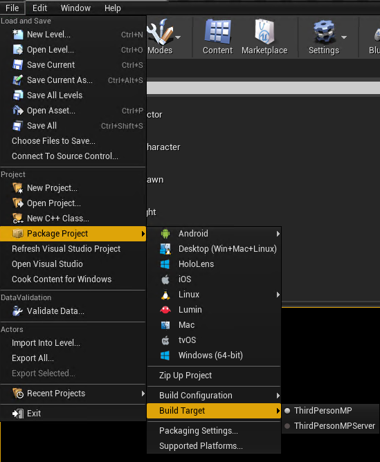
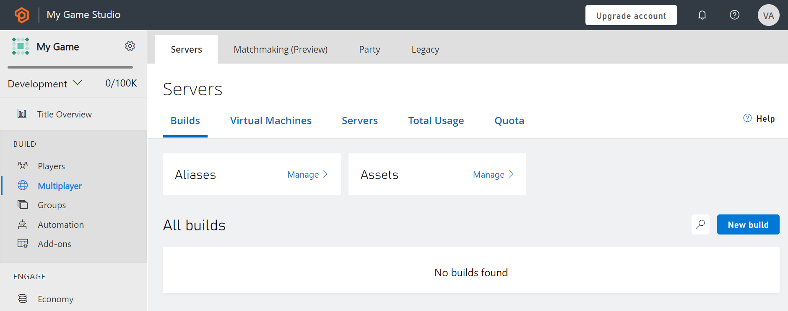
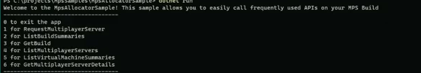
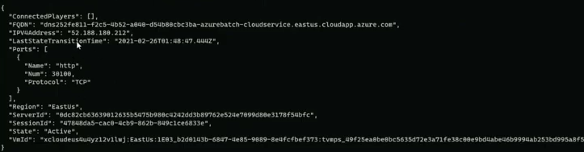

# PlayFab Multiplayer Unreal Game Server Sample

## Prerequisites
- Download Unreal Engine Source Build by following [these instructions](https://docs.unrealengine.com/4.26/en-US/ProgrammingAndScripting/ProgrammingWithCPP/DownloadingSourceCode/) from the Unreal website
- Download Unreal Engine (this was tested on 4.26.2)
- Download the [Unreal PlayfabGSDK Plugin folder](https://github.com/PlayFab/gsdk/tree/master/UnrealPlugin)
- Download Visual Studio (the [community version is free](https://visualstudio.microsoft.com/vs/community/))
- When running locally you must have a copy of [Local Multiplayer Agent](https://github.com/PlayFab/MpsAgent/releases)
- A developer.playfab.com account

OPTIONAL:
- Clone the [MpsSamples repository](https://github.com/PlayFab/MpsSamples)
	- In order to use it, you need to have installed [.NET Core](https://dotnet.microsoft.com/download/dotnet-core)

## Getting Started

#### Create a multiplayer game
First, you need to start by creating a multiplayer game with a dedicated server! Thankfully, Unreal has a tutorial to help you 
make a [third person multiplayer game from scratch](https://docs.unrealengine.com/4.26/en-US/InteractiveExperiences/Networking/QuickStart/).

#### Setting up a dedicated server

Once you have created your game, you can set up a dedicated server. A dedicated server is one that is dedicated to only hosting the game 
and no local players play on the machine because everyone connected is a client. You can do this by following [these instructions]
(https://docs.unrealengine.com/4.26/en-US/InteractiveExperiences/Networking/HowTo/DedicatedServers/) from Unreal's documentation.

#### Integrate the Playfab GSDK plugin
Once you've followed this tutorial and created your third person multiplayer game, then you can integrate the Unreal Playfab GSDK Plugin
[using these instructions](https://github.com/PlayFab/gsdk/blob/master/UnrealPlugin/README.md).

## How to use the packaged server and client

Now that you have a packaged game server, you can also package your game client. Open your Unreal Engine Editor and go to File -> Package Project -> Build Target -> [game name] and then go to File -> Package Project -> Windows (64-bit), and choose
what folder you want this file to be saved to. 



The packaged game client will be in a folder called "WindowsNoEditor".

### Testing Locally using LocalMultiplayerAgent

The following instructions will be for container mode. Because of this, we first need to ensure that our zipped game server has all required system DLLs that are not included in the container image. 

To check this, you need to determine the required DLLs by running the ListDLLs tool that is [found here.](https://docs.microsoft.com/en-us/gaming/playfab/features/multiplayer/servers/determining-required-dlls)

Once you have included all the necessary DLLs, follow the instructions to set up the [Local Multiplayer Agent](https://docs.microsoft.com/en-us/gaming/playfab/features/multiplayer/servers/locally-debugging-game-servers-and-integration-with-playfab) release that you downloaded and configure the MultiplayerSettings file by following the ***instructions for running your game server in container mode.***

Also, please ensure that the start command for your game server is running the executable found in the binaries folder, not the root file which I discovered through [this Playfab Community](https://community.playfab.com/questions/53596/localvmagent-not-working-while-running-container-m.html) post. 

```
eg: C:\Assets\YourGame\Binaries\Win64\YourGameServer.exe
```

Then when your game server is running through LocalMultiPlayerAgent and has a status of *Active*, you can run your client from the command line with a specific IP address and port as arguments. For example, this command:

```
.\GameClient.exe 127.0.0.1 -port=30000
```

would mean that you are running your game client executable, GameClient.exe, to connect to your game server that is on 127.0.0.1 (i.e. local host) through port 30000. You can learn more about [command line arguments here](https://docs.unrealengine.com/4.26/en-US/ProductionPipelines/CommandLineArguments/).

### Testing using Playfab MPSAllocatorSample

With your [developer.playfab.com](developer.playfab.com) account, create a new TitleID or use an existing one.

Click on this new TitleID, and go the Multiplayer tab under the Build section.



Create a new build and make sure that the Server type is "Container". Upload your zipped up game server along with all of the DLLs (the same one you used with LocalMultiplayerAgent) and make sure the mount path and start command are correct.

Set the port to be Unreal's port number, 7777.

Then choose whichever regions you would like and create the new build. 

Give the build a few minutes to be deployed.

Once your build is deployed, make sure that you have the MpsSamples repository cloned on your desktop. 

Navigate to MpsSamples\MpsAllocatorSample and use the command:

```
dotnet run
```

which will launch the MpsAllocatorSample, where you can choose from a menu of 7 API options to call that are frequently used.



To see your build summaries, choose option 2.

To request a new multiplayer server, choose option 1 and make sure you have your BuildID, regions, and players. After entering this information, you should have an active game server. 



Using the port and IP address from this server, your players can now run your game client from the command line!

#### For more Information about MpsAllocatorSample

In order to understand how the MpsAllocatorSample works an a more in-depth manner, you can [watch this video]( https://www.youtube.com/watch?v=kj2TcMlvWgk) that is an introductory level overview of Azure PlayFab Multiplayer Servers, with guided steps to help developers successfully build & deploy a sample game server on PlayFab.